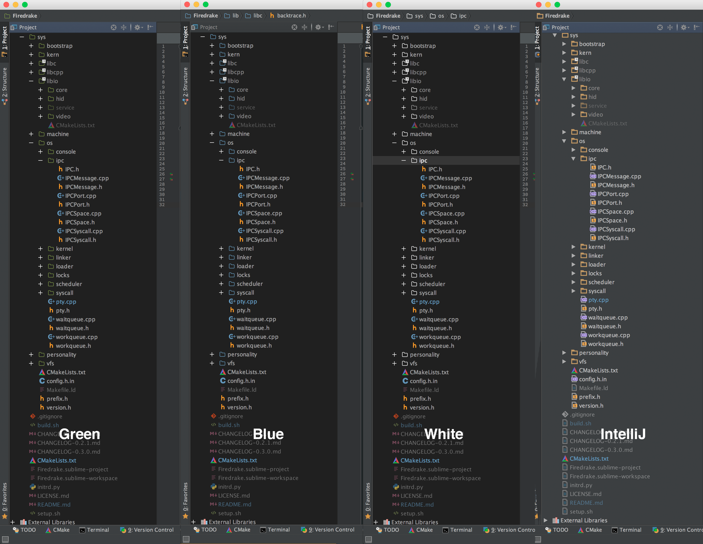

# Afterglow IntelliJ

This theme for IntelliJ is based on the the [Afterglow Sublime Text](https://github.com/YabataDesign/afterglow-theme) theme,
and replaces the default sidebar icons and colour of IntelliJ. It should be compatible with all IntelliJ IDEs and has been tested
 with IntelliJ Ultimate, CLion, AppCode, WebStorm, PyCharm and RubyMine.
 
# Screenshot

Pictures, thousand words etc:

# License

The code is available under the MIT license, the icons are copyright by [Yabata Design](https://github.com/YabataDesign)